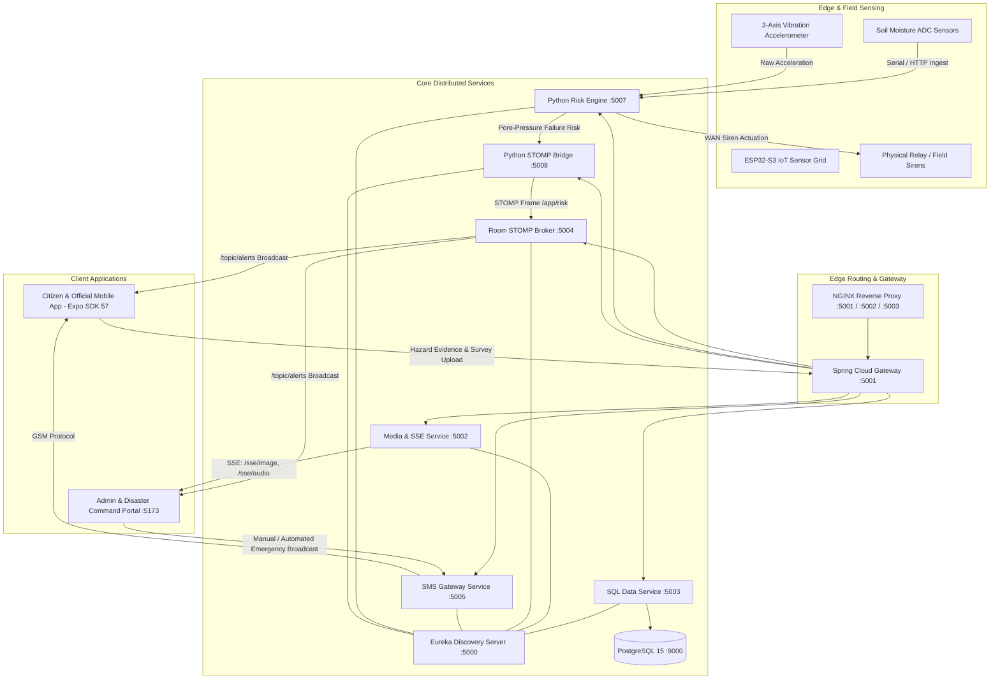

# Project RAKSHAK: Autonomous Landslide Early Warning & In-Situ Geotechnical Telemetry Platform

### Smart India Hackathon (SIH) — Problem Statement 1
**Domain:** Disaster Management, Geotechnical Engineering, and IoT-Driven Early Warning Systems (EWS)  
**Target Corridor:** Northeast Region of India (NER) — Himalayas, Aizawl (Mizoram), Unakoti (Tripura)

---

## 1. Executive Summary

Project **RAKSHAK** is an end-to-end, multi-tier disaster mitigation platform engineered to provide real-time landslide monitoring, geotechnical failure forecasting, and sub-second emergency evacuation dissemination for vulnerable montane slope communities in Northeast India.

The platform fuses in-situ soil moisture ADC readings, 3-axis vibration telemetry, and meteorological precipitation data with the Geological Survey of India (GSI) National Landslide Inventory. Upon threshold violation, RAKSHAK orchestrates automated, multi-channel alerts across low-latency STOMP WebSocket streams, Server-Sent Events (SSE), field sirens, and localized GSM SMS gateways without requiring manual intervention.

```
+-----------------------------------------------------------------------------------------+
|                                    PROJECT RAKSHAK                                      |
+---------------------------+-----------------------------+-------------------------------+
|       USER (Mobile)       |        ADMIN (Portal)       |      BACKEND (Microservices)  |
|  React Native / Expo 57   |    React 19 / MapLibre GL   |    Spring Cloud 3 + FastAPI   |
|  - Real-Time STOMP Alerts |  - Northeast GIS Heatmaps   |  - Eureka Service Registry    |
|  - Proximity Kiosk Route  |  - Sensor Analytics Curves  |  - ADC Geotechnical Engine    |
|  - 7-Point Hazard Survey  |  - Emergency SMS Console    |  - Multipart SSE Media Stream |
|  - Photo & Voice Ingest   |  - Field Evidence Audit     |  - PostgreSQL 15 Relational   |
+---------------------------+-----------------------------+-------------------------------+
```

---

## 2. End-to-End System Architecture



---

## 3. Subsystem Repositories

Comprehensive technical specifications, schema definitions, mathematical formulations, and execution instructions are documented within each dedicated module:

| Subsystem | Primary Technologies | Technical Documentation |
| :--- | :--- | :--- |
| **Backend Services** | Java 21, Spring Boot 3, Spring Cloud, Python 3.11, FastAPI, PostgreSQL 15, NGINX | [backend/README.md](file:///c:/Coding/sih-ps-1/backend/README.md) |
| **Admin Command Portal** | React 19, Vite, MapLibre GL, Turf.js, Chart.js, TailwindCSS v4 | [admin/README.md](file:///c:/Coding/sih-ps-1/admin/README.md) |
| **Citizen & Official Mobile App**| React Native 0.86, Expo SDK 57, Expo Router, Zustand, NativeWind, STOMP | [user/README.md](file:///c:/Coding/sih-ps-1/user/README.md) |

---

## 4. Key Engineering Innovations

### 4.1. Calibrated In-Situ Soil Moisture & Failure Curve
The risk engine maps continuous analog sensor readings into discrete pore-water pressure saturation states:
$$\text{Moisture \%} = \max\left(0, \min\left(100, \frac{\text{ADC}_{\max} - \text{ADC}}{\text{ADC}_{\max} - \text{ADC}_{\min}} \times 100\right)\right)$$
where $\text{ADC}_{\min} = 100$ (saturation threshold) and $\text{ADC}_{\max} = 500$ (dry slope baseline).
- **Critical Threshold ($\text{ADC} < 200$)**: Risk triggers to $\ge 91\%$. Automatically commands sirens, locks emergency UI states, initiates SMS broadcasts, and pushes evacuation coordinates to connected citizens.
- **Moderate Threshold ($200 \le \text{ADC} < 250$)**: Risk elevates to $\sim 69\%$. Advisories are dispatched to district disaster management units.

### 4.2. Geospatial Inverse Masking & Landslide Inventory Fusion
- Leverages `@turf/turf` to compute geometric union and inverse topological masking for the 8 Northeast Indian states (Arunachal Pradesh, Assam, Manipur, Meghalaya, Mizoram, Nagaland, Sikkim, Tripura), dimming outer regions and highlighting vulnerable corridors.
- Incorporates the 11.8 MB Geological Survey of India (GSI) National Landslide Inventory (`gsi_landslide_inventory.geojson`) with dynamic simulated precipitation ($R_{1h}, R_{24h}, R_{7d}$) for spatial failure correlation.

### 4.3. Zero-Polling Server-Sent Events (SSE) Evidence Pipeline
- Field photos and audio memos uploaded by citizens are stored in persistent Docker volumes and broadcast instantly to disaster management consoles via `/sse/image` and `/sse/audio`.
- Eliminates administrative database polling and reduces incident review time from minutes to milliseconds.

### 4.4. Proximity-Based Evacuation Kiosk Routing
- Implements on-device Haversine distance calculations against the Northeast Kiosk Network (`UNAKOTI_NODE_85`, `KIO-MZ-040`, `KIO-MZ-048`), displaying bearing angle, distance ($km$), and direct evacuation waypoints during communications failure.

---

## 5. Unified System Orchestration

### 5.1. Prerequisites
- Docker Engine $\ge 24.0$ & Docker Compose v2
- Node.js $\ge 18.0$ & npm $\ge 9.0$
- Java 21 JDK & Apache Maven 3.9+
- Python 3.11+

### 5.2. Running the Complete Infrastructure

#### Step 1: Start Backend Microservices Stack
```bash
cd backend
docker compose up -d --build
```
Verify that all services report healthy status via Eureka at `http://localhost:5000`.

#### Step 2: Start Administrative Command Console
```bash
cd ../admin
npm install
npm run dev
```
Access the command dashboard at `http://localhost:5173`.

#### Step 3: Launch Citizen Mobile Application
```bash
cd ../user
npm install
npx expo start
```
Scan the generated QR code using the Expo Go application on Android/iOS.

---

## 6. Port Map & Network Specifications

| Port | Service Name | Protocol | Purpose |
| :--- | :--- | :--- | :--- |
| **5000** | `discovery-service` | HTTP | Spring Cloud Eureka Service Registry |
| **5001** | `gateway-service` / NGINX | HTTP / WS | Primary API Gateway & Path Translator |
| **5002** | `media-service` | HTTP / SSE | Media Storage & Server-Sent Events Ingestion |
| **5003** | `sql-service` | HTTP | Relational Database REST Access |
| **5004** | `room-service` | WebSocket / STOMP | Real-Time Tactical Alerts Broker (`/topic/alerts`) |
| **5005** | `sms-service` | HTTP / GSM | Hardware GSM Modem & SMS Broadcast Integration |
| **5007** | `risk-engine-service`| HTTP / WS | Geotechnical ADC Computation & Siren Actuation |
| **5008** | `stomp-service` | WebSocket / STOMP | Python STOMP Dispatch Bridge |
| **8000** | `socket-service` | WebSocket | Direct Telemetry WebSocket Multiplexer |
| **9000** | `postgres` | TCP | PostgreSQL 15 Relational Database |
| **5173** | `admin` | HTTP | Administrative Web Dashboard (Vite) |
