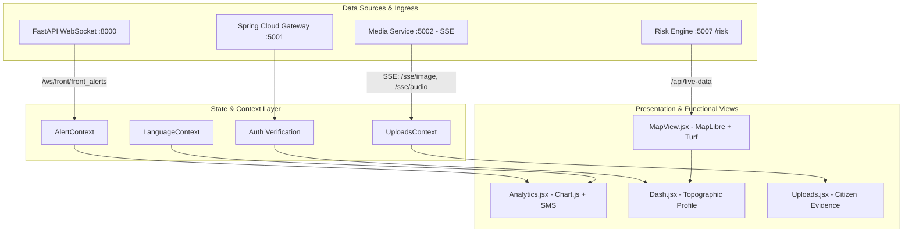

# RAKSHAK Admin & Geotechnical Operations Portal

Command and control dashboard for the RAKSHAK Landslide Early Warning System (Smart India Hackathon - Problem Statement 1).

The portal provides disaster response authorities, geotechnical engineers, and administrative bodies (Ministry of Development of North Eastern Region - MDoNER, State Disaster Management Authorities - SDMA, and District Emergency Operations Centres - DEOC) with real-time in-situ sensor telemetry, spatial hazard heatmaps, automated SMS dispatch consoles, and live crowdsourced incident evidence feeds.

---

## 1. Core Capabilities

- **Real-Time In-Situ Geotechnical Monitoring**: Continuously renders raw ADC soil moisture profiles, vibration indexes, and precipitation metrics from field IoT nodes.
- **Geospatial GIS Risk Visualization**: Employs MapLibre GL and Turf.js to render vector boundaries, inverse spatial masks for Northeast Indian states, and multi-tier hazard heatmaps.
- **Topographic Terrain Profiling**: Ingests Digital Elevation Model (DEM) derivates—including slope, aspect, profile/plan curvature, flow accumulation, and Topographic Wetness Index (TWI).
- **Emergency Early Warning SMS Console**: Provides manual and sensor-automated SMS evacuation dispatches to registered citizens within hazardous slope corridors.
- **Live Crowdsourced Media Repository**: Uses Server-Sent Events (SSE) to display incoming citizen photographic evidence and audio memos without page reloads.
- **Trilingual Operator Interface**: Full localization support across English (EN), Hindi (HI), and Bengali (BN).

---

## 2. Technology Stack & Libraries

| Category | Technology / Library | Version | Operational Function |
| :--- | :--- | :--- | :--- |
| **Core Framework** | React | 19.2.8 | Declarative UI component architecture |
| **Build & Tooling** | Vite | 8.3.0 | Rapid Hot Module Replacement (HMR) and optimized Rollup bundling |
| **Styling Engine** | TailwindCSS | 4.3.3 | Responsive utility-based styling |
| **GIS Mapping** | MapLibre GL | 6.6.0 | WebGL vector map rendering |
| **React Map Wrapper**| react-map-gl | 8.1.2 | Reactive React bindings for MapLibre |
| **Spatial Analysis** | @turf/turf | 7.4.0 | Topological union, geometric polygon masking, spatial clipping |
| **Data Visualization**| Chart.js / react-chartjs-2 | 4.5.1 / 5.3.1 | Real-time sliding window telemetry charts and trend analysis |
| **Routing** | React Router DOM | 7.18.3 | Client-side routing and protected navigation |

---

## 3. Architecture & Data Flow



---

## 4. Key Functional Modules

### 4.1. Geotechnical Analytics & Telemetry Console (`Analytics.jsx`)
Provides multi-metric telemetry observation with sliding-window time-series charts:
- **ADC Soil Moisture Sensor**: Maps analog readings against geotechnical threshold curves:
  - $\text{ADC} < 200$: Critical Wet Soil Hazard (Evacuation State).
  - $200 \le \text{ADC} < 250$: Moderate Risk Soil (Watch State).
  - $\text{ADC} \ge 250$: Stable Baseline Soil (Nominal State).
- **Rainfall Ingestion**: Tracks 1-hour intensity ($R_{1h}$), 24-hour accumulation ($R_{24h}$), and 7-day antecedent rainfall ($R_{7d}$) critical for pore-water pressure build-up calculation.
- **Vibration Sensor Metric**: Normalizes 3-axis accelerometer shockwaves from $0.0$ to $1.0$ to identify active mass movement or seismic disturbance.
- **SMS Early Warning Dispatch Console**:
  - Interlocked dispatch logic: Automated standby mode during nominal slope states.
  - Automatically unlocks or triggers when Risk $\ge 85\%$ or Soil ADC $< 200$.
  - Includes manual broadcast override buttons for emergency evacuation notices.

### 4.2. Interactive GIS Risk Map (`MapView.jsx`)
Renders high-resolution geospatial vector representations of the Northeast Region (NER) of India:
- **Administrative Bounding & Masking**:
  - Ingests GeoJSON boundaries for the 8 NER states: Arunachal Pradesh, Assam, Manipur, Meghalaya, Mizoram, Nagaland, Sikkim, Tripura.
  - Utilizes `@turf/turf` to execute polygon union operations and compute an inverse spatial mask:
    $$\text{Mask} = \text{WorldPolygon} \setminus \bigcup_{i=1}^{8} \text{StatePolygon}_i$$
  - Dimmed exterior shading focuses operator attention exclusively on the Northeast corridor.
- **Dynamic Risk Heatmap Layer**:
  - Multi-stop color ramp: Soft Teal ($0.15$) $\to$ Emerald Green ($0.40$) $\to$ Muted Amber ($0.65$) $\to$ Orange ($0.85$) $\to$ Dark Orange / Crimson ($1.00$).
  - Zoom-dependent radius ($12\text{px}$ at zoom 3.5 to $28\text{px}$ at zoom 6.8) and weight interpolation.
- **Geological Survey of India (GSI) Layer**: Direct integration with historical landslide inventory data (`gsi_landslide_inventory.geojson`) allowing spatial correlation between historical failures and current telemetry.

### 4.3. Slope & Sector Topographic Console (`Dash.jsx`)
Presents derived Digital Elevation Model (DEM) geotechnical factors for selected slope zones (e.g., Unakoti Sector, Tripura; Aizawl Slopes, Mizoram):
- **Maximum & Mean Elevation ($m$)**: Absolute vertical relief determining gravitational potential energy.
- **Maximum & Mean Slope Angle ($^\circ$)**: Critical shearing threshold parameter.
- **Steep Slope Ratio**: Proportion of localized grid cells exceeding critical failure angle ($> 35^\circ$).
- **Plan & Profile Curvature**: Identifies divergent/convergent drainage flowlines and accelerating slope segments.
- **Topographic Wetness Index (TWI)**: Quantifies topographic control on hydrological saturation processes:
  $$\text{TWI} = \ln\left(\frac{\alpha}{\tan \beta}\right)$$
  where $\alpha$ is upslope contributing drainage area and $\beta$ is local slope gradient.

### 4.4. Field Hazard Documentation & Media Ingest (`Uploads.jsx` & `UploadsContext.jsx`)
Central repository for real-time citizen-submitted visual evidence and voice memos:
- **Server-Sent Events (SSE) Listener**: Maintains persistent HTTP connections to `media-service` (`/sse/image` and `/sse/audio`), appending incoming reports to the state without polling.
- **Filtering & Audit Matrix**: Allows sorting between photographic evidence, audio recordings, and composite reports.
- **Geotechnical Assessment Inspector**: Clicking an incident record opens a full modal displaying:
  - High-resolution photograph or playable HTML5 audio player.
  - Time, date, and citizen phone number.
  - Georeferenced GPS coordinates with link to spatial view.
  - 7-Point Field Hazard Questionnaire (Active movement status, current precipitation, threatened infrastructure, visible warning signs, immediate evacuation requirement).

---

## 5. Directory Structure

```
admin/
├── src/
│   ├── components/
│   │   ├── alerts/          # Alert banner components and countdown timers
│   │   ├── common/          # PageHeader, status badges, buttons, typography
│   │   ├── reports/         # Hazard reporting summaries and metric cards
│   │   ├── riskmap/         # MapLibre controls, legend overlays, layer toggles
│   │   ├── stations/        # Sensor station diagnostic cards and ping trackers
│   │   └── uploads/         # Media display modals and evidence cards
│   ├── config/
│   │   └── env.js           # Centralized environment variable resolution
│   ├── context/
│   │   ├── AlertContext.jsx # Real-time WebSocket risk stream context
│   │   └── LanguageContext.jsx # Trilingual (EN, HI, BN) localization provider
│   ├── data/                # Static fallback mock datasets and GeoJSON indices
│   ├── hooks/               # Custom React hooks (useWebSocket, useTelemetry)
│   ├── layouts/             # Navigation bars, sidebars, dashboard shell
│   ├── Analytics.jsx        # Geotechnical charts, sensor curves, SMS dispatch
│   ├── App.jsx              # Application router and protected routes
│   ├── constants.js         # Color ramps, alert schemas, administrative levels
│   ├── Dash.jsx             # Topographic metrics and corridor summaries
│   ├── Login.jsx            # Administrative authentication screen
│   ├── MapView.jsx          # MapLibre GL spatial map with Turf.js masking
│   ├── mapUtils.js          # GeoJSON transformations and geometry computations
│   ├── Uploads.jsx          # Citizen media and voice memo repository
│   └── UploadsContext.jsx   # SSE event subscriber for live incident updates
├── index.html
├── package.json
├── tailwind.config.js
└── vite.config.js
```

---

## 6. Environment Configuration

All backend network endpoints are centralized in `src/config/env.js`. Configure `.env`:

```ini
# Spring Cloud Gateway Base URL
VITE_API_BASE_URL=http://localhost:5001

# Dedicated Risk Engine Route (via Gateway)
VITE_RISK_API_URL=http://localhost:5001/risk

# Real-Time Telemetry & Alert WebSocket Ingress
VITE_PYTHON_WS_URL=ws://localhost:8000
VITE_WS_ALERT_URL=ws://localhost:8000/ws/front/front_alerts

# WebSocket Reconnection Interval (milliseconds)
VITE_WS_RECONNECT_INTERVAL=5000

# Mock Fallback (true allows offline demonstration when backend is disconnected)
VITE_ENABLE_MOCK_FALLBACK=true
```

---

## 7. Setup & Build Instructions

### 7.1. Prerequisites
- Node.js $\ge 18.0.0$ (Node.js 20 LTS recommended)
- npm $\ge 9.0.0$

### 7.2. Installation
```bash
cd admin
npm install
```

### 7.3. Local Development Server
```bash
npm run dev
```
The application will launch at `http://localhost:5173`.

### 7.4. Administrative Login Credentials
- Default Operator Account: `admin` / Password: Any non-empty string.
- Direct bypass: Navigating to `/dash` requires `localStorage.getItem("user") === "admin"`.

### 7.5. Production Compilation
```bash
npm run build
```
Generates production-optimized static bundles inside the `dist/` directory ready for deployment via NGINX or static hosting servers.
