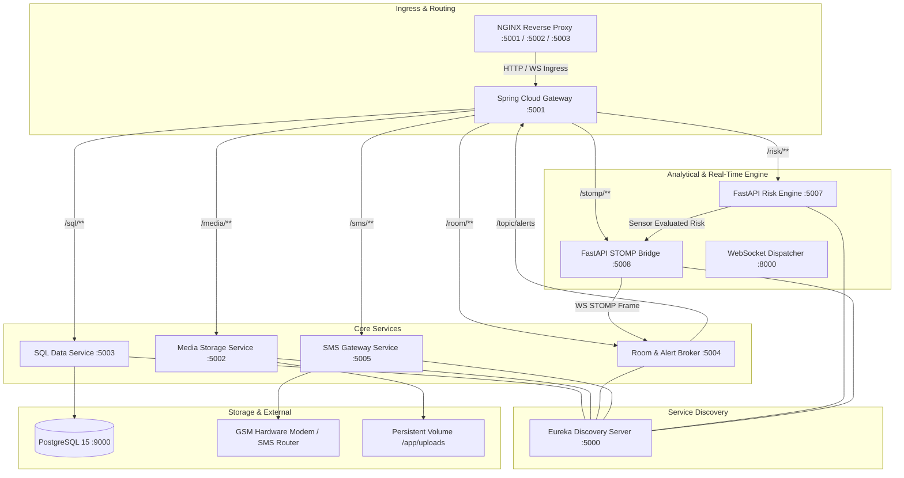

# RAKSHAK Backend Services

Distributed, high-availability microservices backend for the RAKSHAK Autonomous Landslide Early Warning and Geotechnical Telemetry Platform (Smart India Hackathon - Problem Statement 1).

The backend processes multi-source telemetry—including in-situ soil moisture ADC readings from ESP32 hardware nodes, Open-Meteo precipitation metrics, and Geological Survey of India (GSI) spatial inventory data—computes real-time landslide failure probabilities, and orchestrates zero-latency emergency alert dissemination across WebSockets, STOMP brokers, Server-Sent Events (SSE), and hardware-interfaced GSM/SMS gateways.

---

## 1. System Architecture

The backend implements a decoupled, polyglot microservices topology orchestrated via Docker Compose and registered dynamically through Spring Cloud Netflix Eureka.



---

## 2. Network & Port Allocation

| Service Identifier | Technology Stack | Internal Port | External Port | Healthcheck Probe | Primary Responsibility |
| :--- | :--- | :--- | :--- | :--- | :--- |
| `nginx` | NGINX Alpine | 5001, 5002, 5003 | 5001, 5002, 5003 | Process status | Reverse proxy, path translation, 24h WebSocket keepalive |
| `discovery-service` | Spring Cloud Eureka | 5000 | 5000 | `/actuator/health` | Centralized dynamic service registry and heartbeat coordinator |
| `gateway-service` | Spring Cloud Gateway (WebFlux) | 5001 | 5001 (via NGINX) | `/actuator/health` | Non-blocking API routing, strip-prefix filtering, CORS enforcement |
| `sql-service` | Spring Boot 3, Java 21, Hibernate | 5003 | 5003 | `/actuator/health` | Citizen registry, employee RBAC, incident metadata persistence |
| `media-service` | Spring Boot 3, Java 21, SSE | 5002 | 5002 | `/actuator/health` | Citizen media ingestion, persistent storage, real-time SSE stream |
| `room-service` | Spring Boot 3, Spring Messaging | 5004 | 5004 | `/actuator/health` | In-memory STOMP/WebSocket broker (`/topic/alerts`) |
| `sms-service` | Spring Boot 3, RestClient | 5005 | 5005 | `/actuator/health` | Asynchronous GSM modem dispatch, localized SMS broadcasting |
| `risk-engine-service`| FastAPI, Python 3.11, Pydantic | 5007 | 5007 | `/health` | ADC sensor curve conversion, GSI geospatial risk synthesis, siren triggers |
| `stomp-service` | FastAPI, `stomp.py`, Python 3.11 | 5008 | 5008 | `/health` | Dynamic Eureka bridge dispatching risk updates to STOMP broker |
| `socket-service` | FastAPI, WebSockets | 8000 | 8000 | TCP open | Direct telemetry WebSocket multiplexer |
| `postgres` | PostgreSQL 15.18 | 5432 | 9000 | `pg_isready` | ACID relational data storage |

---

## 3. Microservice Specifications

### 3.1. Gateway Service (`gateway-service`)
Built on Spring Cloud Gateway and Netty (Reactive WebFlux). Provides non-blocking request routing based on Eureka service identifiers:

```yaml
routes:
  - id: media-service      uri: lb://MEDIA-SERVICE       Path=/media/**      StripPrefix=1
  - id: sql-service        uri: lb://SQL-SERVICE         Path=/sql/**        StripPrefix=1
  - id: sms-service        uri: lb://SMS-SERVICE         Path=/sms/**        StripPrefix=1
  - id: room-service       uri: lb://ROOM-SERVICE        Path=/room/**       StripPrefix=1
  - id: risk-engine-service uri: lb://RISK-ENGINE-SERVICE Path=/risk/**       StripPrefix=1
  - id: stomp-service      uri: lb://STOMP-SERVICE       Path=/stomp/**      StripPrefix=1
```
- **Global CORS**: Permits cross-origin interactions across web dashboards and mobile applications with permissive headers and standard HTTP methods.
- **Heartbeat & Renewal**: Configured with 10s registry fetch intervals and 30s lease expiration for rapid service discovery failover.

### 3.2. Geotechnical Risk Engine (`risk-engine-service`)
FastAPI application executing analytical risk heuristics on sensor feeds and GIS boundaries.

- **Sensor Bulk Ingestion (`POST /api/soil/bulk`)**: Accepts serial COM ADC values transmitted by IoT field nodes:
  $$\text{Moisture \%} = \max\left(0, \min\left(100, \frac{500 - \text{ADC}}{400} \times 100\right)\right)$$
  - $\text{ADC} < 200$: Critical pore-pressure saturation. Evaluates Risk to $91.0\% - 94.0\%$. Initiates asynchronous SMS dispatch to registered citizens within sector (60-second rate-limiting cooldown) and broadcasts siren triggers to WAN hardware actuators.
  - $200 \le \text{ADC} < 250$: Elevated saturation warning state. Evaluates Risk to $69.0\% - 75.0\%$.
  - $250 \le \text{ADC} < 350$: Moderate baseline moisture. Evaluates Risk to $34.0\% - 41.0\%$.
  - $\text{ADC} \ge 450$: Dry soil condition. Evaluates Risk to $20.0\% - 26.0\%$.
- **Geospatial Inventory Fusion (`GET /api/live-data`)**: Synthesizes the 11.8 MB Geological Survey of India (GSI) National Landslide Inventory (`gsi_landslide_inventory.geojson`) with dynamic precipitation models ($R_{1h}$, $R_{24h}$, $R_{7d}$ antecedent rainfall) and latest telemetry arrays without mutating static spatial geometry.
- **Hardware Actuation (`POST /trigger-alert` and `WS /ws/{device_id}`)**: Maintains persistent bi-directional WebSockets to deployed field siren/relay microcontrollers. Dispatches millisecond-calibrated buzzer pulses (`duration_ms`) upon threshold violation.

### 3.3. STOMP Dispatch Bridge (`stomp-service`)
Python bridge running `stomp.py` with WebSocket adapter (`WSStompConnection`). Resolves `room-service` instance location from Eureka discovery metadata dynamically:
- Connects to `/ws/alerts` via STOMP frame protocol.
- Publishes serialized risk payloads `{"riskPercentage": "<value>"}` to destination `/app/risk`.
- Eliminates hardcoded service IP bindings across container restarts.

### 3.4. Room & Alert Broker Service (`room-service`)
Spring Boot STOMP broker facilitating full-duplex communication with mobile and dashboard clients:
- **Broker Endpoint**: `/ws/alerts` (supported via SockJS and native WebSocket).
- **Public Topic**: `/topic/alerts`.
- **Inbound Message Mapping (`/app/risk`)**: Receives computed risk frames from `stomp-service` or manual administrative overrides and fans out payload to all connected subscriber nodes.
- **Tactical Escalation (`POST /alert`)**: Authenticated endpoint for emergency authorities (MDoNER, Zonal Admins, District Admins) to trigger high-priority push escalations.
- **Upload Notification Broadcast (`POST /upload-event`)**: Broadcasts real-time events upon receipt of crowdsourced citizen field documentation.

### 3.5. Relational Data Management (`sql-service`)
Spring Data JPA service running on PostgreSQL 15:
- **Schema `citizens`**: Tracks citizen phone identifier (Primary Key), current latitude, longitude coordinates, localized language preference (`en`, `hi`, `bn`), and timestamp of last telemetry ping.
- **Schema `employees`**: Implements Role-Based Access Control (RBAC) for disaster administrative tiers:
  - Roles: `MDoNER Employee`, `Zonal Admin`, `District Admin`.
  - Scoped authority: Department, State, District jurisdiction validation.
- **Schema `uploads`**: Stores citizen-submitted hazard documentation records:
  - File metadata (type: image/audio, storage filename, date, time).
  - Georeferenced coordinates (latitude, longitude).
  - Serialized questionnaire assessment payload (7-point hazard survey).

### 3.6. Media Ingestion & Real-Time SSE Service (`media-service`)
Spring Boot service handling binary multimedia assets uploaded from the field:
- **Multi-part Ingestion (`POST /upload`)**: Parses multipart image (`.jpg`, `.png`) and audio memo (`.m4a`, `.mp3`, `.wav`) payloads, writes assets to `/app/uploads` persistent Docker volume, and registers metadata with `sql-service`.
- **Zero-Polling SSE Streaming**: Exposes Server-Sent Events endpoints:
  - `GET /sse/image`: Emits new photographic evidence records to listening admin consoles immediately.
  - `GET /sse/audio`: Emits audio telemetry memos to admin audio monitoring consoles.
- **Static Asset Serving (`GET /files/{filename}`)**: Streams stored media assets inline with dynamic MIME-type resolution and memory cache fallback.

### 3.7. SMS Gateway Integration Service (`sms-service`)
Spring Boot driver interfacing with physical GSM modems or dedicated SMS hardware gateways:
- **Dynamic Gateway Rebinding**: Provides runtime IP, port, and Basic Auth credential reconfiguration (`updateIp`) without restarting container daemon.
- **Multilingual Emergency Dispatch**: Automated templating engine formatting critical evacuation advisories in English, Hindi, and local Northeast languages.
- **Batch Sector Dispatch**: Queries `sql-service` for citizens located within affected geospatial bounding boxes and triggers asynchronous non-blocking dispatch threads.

---

## 4. Database Schema (PostgreSQL 15)

```sql
-- Citizens Table
CREATE TABLE citizens (
    number BIGINT PRIMARY KEY,
    lat DOUBLE PRECISION NOT NULL,
    long DOUBLE PRECISION NOT NULL,
    lang VARCHAR(10) NOT NULL DEFAULT 'en',
    last_updated_at TIMESTAMP
);

-- Employees & Administrative RBAC Table
CREATE TABLE employees (
    id BIGSERIAL PRIMARY KEY,
    employee_id VARCHAR(50) UNIQUE NOT NULL,
    name VARCHAR(255) NOT NULL,
    password VARCHAR(255) NOT NULL,
    role VARCHAR(50) NOT NULL, -- 'MDoNER Employee', 'Zonal Admin', 'District Admin'
    department VARCHAR(100),
    state VARCHAR(50),
    district VARCHAR(50),
    active BOOLEAN NOT NULL DEFAULT TRUE,
    created_at TIMESTAMP DEFAULT CURRENT_TIMESTAMP
);

-- Citizen Hazard Evidence & Questionnaire Records
CREATE TABLE uploads (
    id BIGSERIAL PRIMARY KEY,
    number BIGINT NOT NULL,
    file_type VARCHAR(50) NOT NULL, -- 'image' | 'audio'
    upload_date DATE NOT NULL,
    upload_time TIME NOT NULL,
    lat DOUBLE PRECISION NOT NULL,
    long DOUBLE PRECISION NOT NULL,
    file_name VARCHAR(255) NOT NULL,
    questionnaire TEXT -- JSON-encoded 7-point hazard survey
);

CREATE INDEX idx_citizens_coords ON citizens(lat, long);
CREATE INDEX idx_uploads_date ON uploads(upload_date DESC);
CREATE INDEX idx_uploads_number ON uploads(number);
```

---

## 5. API Reference & Contract Specifications

### 5.1. Risk Engine Service (`/risk` via Gateway)

| Endpoint | Verb | Request Payload | Response Payload | Description |
| :--- | :--- | :--- | :--- | :--- |
| `/api/soil/bulk` | `POST` | `[{"timestamp": "ISO", "value": "116.5"}]` | `{"status": "success", "received_count": N}` | Ingests raw serial ADC readings, triggers emergency logic |
| `/api/soil-series`| `GET` | None | `{"latest_hardware_moisture": [...]}` | Fetches current sliding telemetry array |
| `/api/live-data` | `GET` | None | GeoJSON `FeatureCollection` | Merges GSI inventory with simulated precipitation & risk |
| `/trigger-alert` | `POST` | `{"device_id": "device_1", "duration_ms": 500}` | `{"status": "success"}` | Dispatches physical siren actuation command to hardware |
| `/ws/{device_id}`| `WS` | Binary/Text ACK | Stream frames | Bi-directional socket to ESP32 siren hardware |

### 5.2. Media & SSE Service (`/media` via Gateway)

| Endpoint | Verb | Request Payload | Response Payload | Description |
| :--- | :--- | :--- | :--- | :--- |
| `/upload` | `POST` | `multipart/form-data` (file, number, lat, long, questionnaire) | `HTTP 200 OK` | Stores media and persists metadata to database |
| `/files/{name}` | `GET` | None | Binary stream (`inline`) | Serves image or audio recording |
| `/sse/image` | `GET` | Text Event Stream | `data: {...UploadDTO}\n\n` | Real-time push stream for citizen photographic reports |
| `/sse/audio` | `GET` | Text Event Stream | `data: {...UploadDTO}\n\n` | Real-time push stream for citizen voice memos |

### 5.3. Room & STOMP Broker (`/room` via Gateway)

| Endpoint | Verb | Protocol | Payload / Frame | Description |
| :--- | :--- | :--- | :--- | :--- |
| `/ws/alerts` | Handshake | WebSocket / STOMP | CONNECT | STOMP connection establishment |
| `/topic/alerts`| Sub | STOMP | `{"riskPercentage": "92.4"}` | Broadcast topic for live risk updates |
| `/app/risk` | Send | STOMP | `{"riskPercentage": "88.0"}` | Inbound channel for manual/sensor risk injection |
| `/alert` | `POST` | HTTP REST | `OfficialEscalationRequestDto` | Administrative high-priority tactical alert broadcast |
| `/upload-event`| `POST` | HTTP REST | `Map<String, Object>` | Broadcasts new upload occurrence to connected clients |

### 5.4. SQL Data Service (`/sql` via Gateway)

| Endpoint | Verb | Request Payload | Response Payload | Description |
| :--- | :--- | :--- | :--- | :--- |
| `/auth/login` | `POST` | `{"employeeId": "...", "password": "..."}` | `EmployeeAuthResponseDto` | Authenticates administrative personnel |
| `/api/telemetry` | `POST` | `{"number": 9832041182, "lat": 24.32, "long": 92.01, "lang": "hi"}` | `Citizen` entity | Updates citizen geofence position and language |
| `/api/uploads` | `GET` | None | `List<Upload>` | Retrieves all submitted citizen hazard documentation |

---

## 6. NGINX Reverse Proxy Configuration

The NGINX edge layer handles traffic routing, path rewriting, and WebSocket stream stability:

```nginx
# Port 5001: Local Gateway & Path Translator
server {
    listen 5001;
    server_name localhost;

    location / {
        proxy_pass http://gateway_backend;
        proxy_set_header Host $host;
        proxy_set_header X-Real-IP $remote_addr;
    }

    # Translates /risk/ws/esp/device_1 -> /ws/esp/device_1 on port 5003
    location /risk/ {
        proxy_pass http://pinggy_receiver/;
        proxy_http_version 1.1;
        proxy_set_header Upgrade $http_upgrade;
        proxy_set_header Connection "upgrade";
        proxy_read_timeout 86400s; # Prevents drops during long-term field monitoring
        proxy_send_timeout 86400s;
    }
}

# Port 5002: Ngrok Webhook & SMS Ingress
# Port 5003: Dedicated Pinggy / ESP32 Receiver Channel
```

---

## 7. Deployment & Verification

### 7.1. Prerequisites
- Docker Engine $\ge 24.0$ & Docker Compose v2
- Java 21 JDK & Apache Maven 3.9+
- Python 3.11 with `pip` and `virtualenv`

### 7.2. Environment Setup
Create `backend/.env` from `.env.example`:
```ini
DB_NAME=rakshak
DB_USERNAME=dev
DB_PASSWORD=dev
SMS_DEVICE_IP=192.168.1.100
SMS_DEVICE_PORT=8080
SMS_DEVICE_USERNAME=admin
SMS_DEVICE_PASSWORD=secret
```

### 7.3. Automated Build & Launch
Execute the build pipeline via the provided orchestration script:
```bash
cd backend/scripts
chmod +x script.sh
./script.sh
```
This builds each Java microservice using `mvn clean package -DskipTests` and initiates the Docker Compose stack with orchestrated healthcheck dependencies.

### 7.4. Manual Docker Launch
```bash
cd backend
docker compose up -d --build
```

### 7.5. Healthcheck Verification
Inspect running container health statuses:
```bash
docker compose ps
```
Verify Eureka registry status at `http://localhost:5000`:
- Ensure `GATEWAY-SERVICE`, `SQL-SERVICE`, `MEDIA-SERVICE`, `ROOM-SERVICE`, `SMS-SERVICE`, `RISK-ENGINE-SERVICE`, and `STOMP-SERVICE` report status `UP`.
