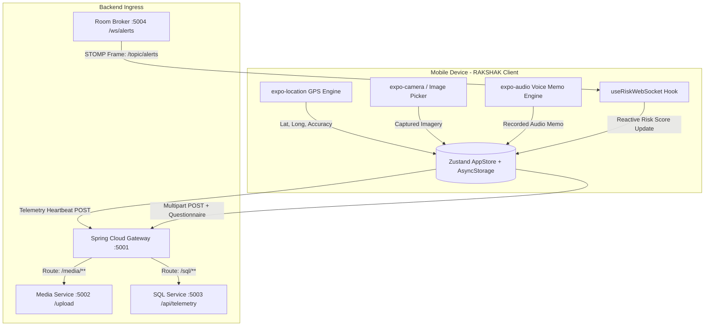

# RAKSHAK Mobile Application

Cross-platform mobile client for the RAKSHAK Landslide Early Warning and Disaster Telemetry System (Smart India Hackathon - Problem Statement 1).

Built on React Native and Expo SDK 57, the application serves as both a citizen-facing early warning terminal and an on-ground field telemetry reporting tool for government personnel (Ministry of Development of North Eastern Region - MDoNER, Zonal Authorities, and District Disaster Management Units).

---

## 1. System Overview & Capabilities

- **Real-Time Landslide Risk Monitoring**: Maintains a full-duplex STOMP over WebSocket connection to the backend broker, streaming live geotechnical risk scores directly to user devices.
- **Proximity-Based Evacuation Kiosk Routing**: Uses the Haversine spatial distance algorithm to calculate the nearest active emergency kiosk or community shelter from the user's real-time GPS coordinates.
- **Crowdsourced Geotechnical Field Ingestion**: Empowers citizens and field rangers to capture and transmit georeferenced hazard photos and ambient audio memos along with a standardized 7-point geotechnical field assessment.
- **Role-Based Access Control (RBAC)**: Distinguishes between public citizens and authenticated government personnel (MDoNER, Zonal, and District Admins), granting officials tactical alert escalation privileges.
- **Offline Resilient State Hydration**: Employs Zustand and AsyncStorage to persist user profiles, cached risk levels, and local queueing logic during cellular blackouts common in montane environments.
- **Multilingual Support (i18n)**: Features native language selection covering English, Hindi, Bengali, and regional Northeast dialects.

---

## 2. Technology Stack & Key Dependencies

| Category | Technology / Dependency | Version | Purpose |
| :--- | :--- | :--- | :--- |
| **Framework** | React Native / Expo | 0.86.3 / ~57.0.20 | Native cross-platform execution (Android & iOS) |
| **Navigation** | Expo Router | ~57.0.19 | Typed file-based routing architecture |
| **Styling** | NativeWind / TailwindCSS | ^4.2.6 / ^3.4.19 | Responsive utility-first styling for mobile layouts |
| **State Management**| Zustand | ^5.0.15 | Lightweight reactive store with local persistence |
| **Storage Engine** | AsyncStorage | 2.2.0 | Asynchronous key-value offline storage |
| **Real-Time Push** | @stomp/stompjs | ^7.3.0 | STOMP client over WebSocket for zero-latency alert reception |
| **Camera & Visual** | expo-camera / expo-image-picker | ~57.0.4 / ~57.0.16 | Hardware camera access, image capture, compression |
| **Audio Processing**| expo-audio | ~57.0.4 | Low-latency voice memo recording and playback |
| **Spatial Telemetry**| expo-location | ~57.0.16 | Continuous high-precision GPS geofence acquisition |
| **HTTP Transport** | Axios | ^1.20.0 | Multipart form-data transmission and REST consumption |

---

## 3. Application Architecture & Data Flow



---

## 4. Key Functional Modules

### 4.1. Real-Time Risk Streaming (`useRiskWebSocket.ts`)
The application subscribes to the distributed Spring STOMP broker:
- **Broker Endpoint**: `ws://<GATEWAY_HOST>:5004/ws/alerts`
- **Subscribed Topic**: `/topic/alerts`
- **Message Handling**: Parses inbound JSON frames containing `{"riskPercentage": "<value>"}`.
- **Alert Dispatch Thresholds**:
  - Risk $< 60\%$: Normal baseline monitoring.
  - $60\% \le \text{Risk} < 85\%$: Warning state (amber banner, advisories enabled).
  - $\text{Risk} \ge 85\%$: Critical emergency threshold. Triggers high-priority visual alert modals, device vibrations, and unlocks emergency evacuation routing.

### 4.2. Nearest Emergency Kiosk Routing (`kiosks.ts` & `StationsViewCard.tsx`)
In catastrophic landslide scenarios, connectivity may drop. The app includes a pre-indexed spatial database of regional disaster kiosks (e.g., Unakoti Node 85, Aizawl Central Node 48) and evaluates the Haversine equation on-device:

$$d = 2R \arcsin\left(\sqrt{\sin^2\left(\frac{\Delta \phi}{2}\right) + \cos(\phi_1)\cos(\phi_2)\sin^2\left(\frac{\Delta \lambda}{2}\right)}\right)$$

- Computes distance ($km$) and provides bearing angle to the nearest operational kiosk equipped with emergency seismic stations and satellite connectivity.

### 4.3. Crowdsourced Geotechnical Field Ingestion (`QuestionnaireModal.tsx`)
When a citizen or field ranger submits photographic or audio evidence, the application prompts for a structured 7-point geotechnical assessment:

| Question Parameter | Input Options | Engineering Relevance |
| :--- | :--- | :--- |
| **Activity Status** | Active landslide, Ground fissures, Falling boulders, Mudflow, Precautionary inspection | Identifies failure phase (initiating vs. post-failure flow) |
| **Weather Condition** | Torrential monsoon downpour, Continuous rain, Severe runoff, Montane fog, Dry | Evaluates pore-pressure saturation drivers |
| **Threatened Infrastructure** | Residential settlements, Highways, Power/Telecom, Bridges/Culverts, Farmland | Prioritizes SDRF/NDRF tactical deployment |
| **Warning Indicators** | Rumbling sounds, Tilting trees/poles, Sudden muddy discharge, Dried springs | Captures sub-surface shear deformation precursors |
| **Urgency Level** | Critical (Immediate life threat), Urgent (Evacuate), Monitor, Informational | Triage level for emergency operations center |
| **Immediate Evacuation**| Boolean (Yes / No) | Instant trigger for district sirens |
| **Field Notes** | Freeform text | Local geographic landmarks or specific entrapments |

The combined payload (image/audio binary + georeferenced coordinates + serialized survey) is transmitted via multipart HTTP POST to `media-service`.

### 4.4. Tactical Escalation for Government Personnel (`home.tsx`)
Authorized officials (MDoNER, Zonal, District Admins) are provided with an **Official Escalation Console**:
- Allows authenticated personnel to declare high-priority sector-wide emergencies directly from mobile devices.
- Dispatches signed payloads to `/room/alert`, immediately activating sirens and warning nodes across the administrative jurisdiction.

---

## 5. Directory Structure

```
user/
├── src/
│   ├── app/                 # Expo Router file-based screens
│   │   ├── _layout.tsx      # Root provider layout, fonts, safe area
│   │   ├── index.tsx        # Authentication entry (Citizen phone / Employee ID)
│   │   ├── home.tsx         # Primary command dashboard & telemetry center
│   │   ├── select-language.tsx # Localization configuration screen
│   │   └── settings.tsx     # Session management and diagnostics
│   ├── components/          # Reusable UI component modules
│   │   ├── AuthSubmitButton.tsx      # Animated form submission button
│   │   ├── CoordinatesCard.tsx       # Live GPS telemetry display & refresh
│   │   ├── CriticalAdvisoryCard.tsx  # Dynamic emergency alert banner
│   │   ├── Header.tsx                # Government branding & status bar
│   │   ├── QuestionnaireModal.tsx    # 7-point geotechnical hazard survey
│   │   ├── StationsViewCard.tsx      # Sensor station status & kiosk distance
│   │   ├── UserUploadsModal.tsx      # History of submitted hazard evidence
│   │   ├── VisualEvidenceCard.tsx    # Camera shutter & image picker card
│   │   ├── VoiceMemoCard.tsx         # Voice recording & playback widget
│   │   └── VulnerabilityCard.tsx     # Localized slope vulnerability index
│   ├── configs/             # Application constants and static endpoints
│   ├── data/                # Hardcoded kiosk registries (UNAKOTI_NODE_85, etc.)
│   ├── hooks/               # Custom hooks (useRiskWebSocket, useTelemetry)
│   ├── services/            # API integration modules (Axios REST, i18n dictionary)
│   └── stores/              # Zustand global application store (useAppStore.ts)
├── app.config.js            # Expo application manifest & bundle identifier
├── babel.config.js          # Babel presets for NativeWind and Reanimated
├── package.json
├── tailwind.config.js
└── tsconfig.json
```

---

## 6. Environment Configuration

Create a `.env` file in the `user/` root directory:

```ini
# Spring Cloud Gateway Base URL (Expose via LAN IP or Ngrok for physical devices)
EXPO_PUBLIC_API_URL=http://192.168.1.50:5001

# Room Service STOMP WebSocket URL
EXPO_PUBLIC_WS_URL=ws://192.168.1.50:5004/ws/alerts

# Enable mock telemetry if running outside sensor grid
EXPO_PUBLIC_ENABLE_MOCK=false
```

---

## 7. Installation, Execution & Build

### 7.1. Prerequisites
- Node.js $\ge 18.0.0$
- Expo CLI (`npm install -g expo-cli`)
- Expo Go application on mobile device OR configured Android Studio / Xcode emulators

### 7.2. Installation
```bash
cd user
npm install
```

### 7.3. Starting Development Server
```bash
npx expo start
```
- Press `a` to open in connected Android emulator or device via ADB.
- Press `i` to open in iOS simulator.
- Scan the printed QR code with the Expo Go app on a physical device connected to the same local network.

### 7.4. Running with Tunnel (For Remote Field Testing)
When testing on cellular networks outside the local WiFi subnet:
```bash
npx expo start --tunnel
```

### 7.5. Production Standalone Binary Compilation (EAS Build)
To compile native `.apk` or `.aab` packages for Android:
```bash
npx eas-cli build --platform android --profile preview
```
